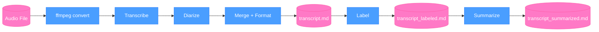
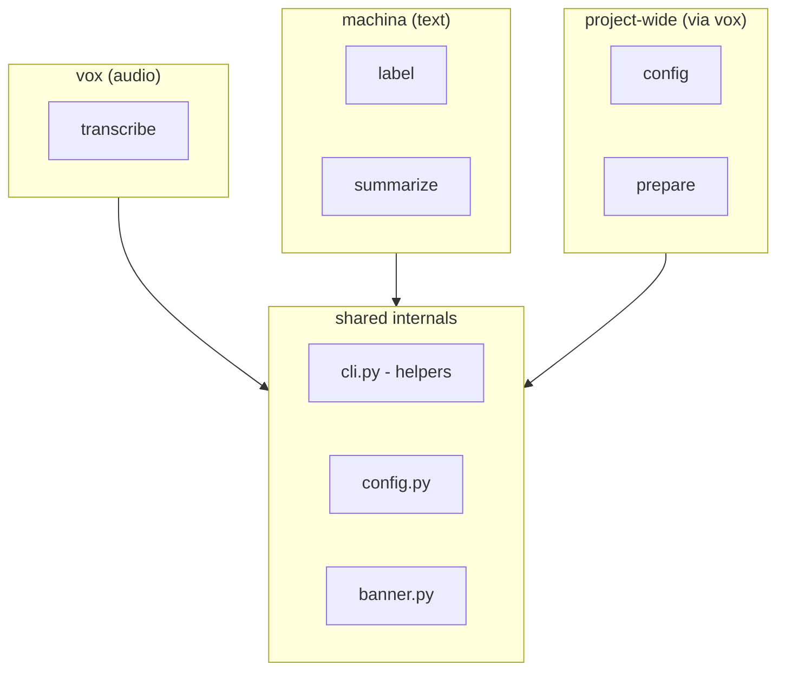

# Architecture

## Philosophy

vox-machina is a focused pipeline tool. Audio in, structured markdown artifacts out. Every output is an input for something else (Obsidian vault, agents, scripts). It's not trying to be a second brain or an agent framework. The boundary is crisp.

## The Pipeline

Audio flows through a series of independent stages. Each stage produces an artifact that the next stage consumes.



Rounded shapes are **artifacts** (files on disk). Rectangular shapes are **pipeline steps** (processing). Each artifact is standalone and can be used independently or fed into the next stage.

## Two CLIs, One Project

The project name mirrors the architecture: **vox** handles the voice/audio domain, **machina** handles the machine/AI text processing domain.



`config` and `prepare` are accessible via `vox` but serve the entire project (both vox and machina use the same config and models).

| Entry point | Commands | Domain |
|-------------|----------|--------|
| `vox` | transcribe, config, prepare | Audio processing + project setup |
| `machina` | label, summarize | Text processing + AI summarization |

Both share the same config file (`~/.config/vox-machina/config.json`), the same banner, and the same helper utilities. The split is purely at the CLI surface.

## Stage Details

### 1. Audio Conversion (`transcribe.py`)

Non-wav audio files are converted to 16kHz mono wav via system ffmpeg before processing. This ensures compatibility with both faster-whisper and pyannote. The temp file is cleaned up after use.

### 2. Transcription (`transcribe.py`)

Uses [faster-whisper](https://github.com/SYSTRAN/faster-whisper) (CTranslate2 backend) to produce timestamped text segments. Returns a list of `TranscriptSegment(start, end, text)`.

- Model size is configurable (default: `large-v3`, stored in config)
- Language can be forced via `--language` flag or auto-detected from first 30 seconds
- Whisper model downloads automatically on first use

### 3. Diarization (`diarize.py`)

Uses [pyannote.audio](https://github.com/pyannote/pyannote-audio) with the `speaker-diarization-community-1` model (CC-BY-4.0) to identify who spoke when. Returns a list of `SpeakerSegment(start, end, speaker)`.

- Requires one-time HuggingFace login for model download
- Falls back gracefully to no speaker labels if diarization fails
- objc/ffmpeg warnings are suppressed via C-level stderr redirect

### 4. Merge (`merge.py`)

Aligns transcript segments with speaker segments using overlap-based matching. Each transcript segment is assigned to the speaker with the greatest time overlap. Returns `MergedSegment(start, end, text, speaker)`.

### 5. Format (`format.py`)

Renders merged segments to markdown. Smart about speaker count:
- **Single speaker**: per-segment timestamps, no speaker labels (clean for voice memos)
- **Multiple speakers**: speaker labels with consecutive grouping (clean for meetings)

Includes metadata in the header: date, duration, whisper model, diarization model.

### 6. Label (`label.py`)

Extracts generic speaker labels (SPEAKER_00, SPEAKER_01) from a transcript and replaces them with real names. Works on the markdown file directly via regex.

Interactive mode shows quotes from each speaker to help identification. Non-interactive mode accepts a mapping via `--speakers` flag.

### 7. Summarize (`summarize.py`)

Sends the transcript to a local Ollama model with a Jinja2 prompt template. The prompt system uses template inheritance:

```
base.md.j2           (shared rules: no commentary, speaker attribution, same language)
  ├── meeting_notes.md.j2   (topics, decisions, action items)
  ├── standup.md.j2          (per-person updates, blockers)
  ├── interview.md.j2        (insights, quotes, themes)
  └── retro.md.j2            (progress, thoughts, next steps)
```

Custom templates work via file path with `{transcript}` placeholder.

Context window (`num_ctx`) is set dynamically based on prompt length to avoid silent truncation.

## Data Models

All structured data uses Pydantic:

```
TranscriptSegment(start: float, end: float, text: str)
SpeakerSegment(start: float, end: float, speaker: str)
MergedSegment(start: float, end: float, text: str, speaker: str)
VoxConfig(whisper_model: str, ollama_model: str)
```

## Config

Persistent user config lives at `~/.config/vox-machina/config.json`. Stores:
- Default whisper model (for transcription)
- Default ollama model (for summarization)

Created via interactive questionnaire on first use or via `vox config`. CLI `--model` flags always override config defaults.
